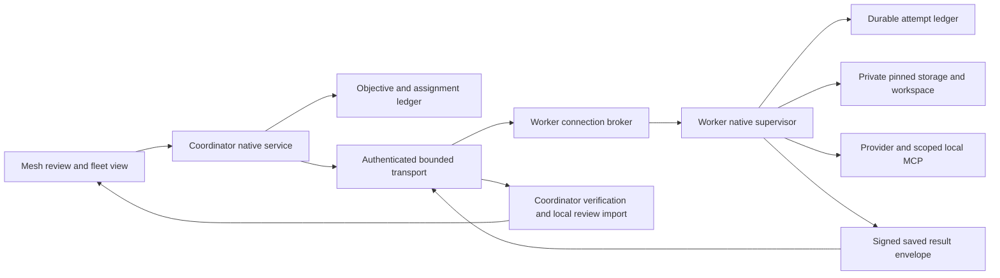

# Remote execution integration contract

This is the implementation direction for the unfinished remote phase, not a claim of remote
execution support. It connects the merged [input foundations](fleet-remote-delivery.md) to the
[complete fleet objective](fleet-orchestration.md). Existing projects, manual work and external
harnesses remain independent of this optional execution route.

## Requirements and boundaries

The coordinator owns objective limits, dependency decisions and the user-visible review selection.
The worker owns its private filesystem, provider processes, execution credentials and durable local
receipts. A remote pathname is never a local `WorkspaceBinding`. Neither side may reinterpret a
lost connection, expired lease or missing response as successful completion or permission to retry.
The renderer displays native facts and cannot admit host keys, storage paths or launch authority.

A verified file tree does not reproduce the source operation DAG. Initializing that tree creates
an independent worker workspace with its own local initial operation. Record both identities:
source input operation/bundle and worker workspace installation/initial operation. Later checkpoints
must descend from that worker initial operation. Never label the worker operation as the original
source operation, or accept a claimed shared ancestry merely because their files match.

Initial deployment targets an explicitly provisioned Unix worker, using only capabilities verified
on that host. No automatic installation, account/SSH-key changes, signing changes or host discovery
is part of executing an assignment. Host/provider admission must report unsupported capabilities
before allocating execution. Actual second-machine evidence remains mandatory.

## Components and data flow

The broker serves transport requests; it does not own the provider's lifetime. A separately admitted
native supervisor owns execution so connection loss cannot silently terminate or relaunch a worker.
The supervisor retains the same custody, signer and scoped MCP rules as local execution. A broker
restart can query retained evidence but cannot adopt a process solely from a PID or a directory name.

Use native-configured OpenSSH stdio as the first transport backend rather than adding a new TLS
server or encryption protocol. SSH supplies encrypted transport and host/account authentication;
Mesh still needs independently admitted coordinator/worker keys and assignment-specific proofs.
The existing worker challenge is only one direction of that proof. It must not become a general
signing oracle, and a reply to it alone cannot authorize a receiver to execute.

The proposed client uses a fixed installed worker entry point, strict host-key verification,
noninteractive authentication, no PTY and no agent/port forwarding. No task, path, goal or secret is
interpolated into a remote shell command. Native host configuration is an authority boundary;
agent-supplied SSH options, aliases or config fragments are not admitted. Verify the deployed
client's supported options; do not silently relax a failed configuration. OpenSSH documents command
execution and forwarding in [ssh(1)](https://man.openbsd.org/ssh.1), and host-key/noninteractive
controls in [ssh_config(5)](https://man.openbsd.org/ssh_config.5).

Task-bearing frames travel over stdin/stdout, not command arguments. Bound frame lengths before
allocation: at most 1 MiB for a manifest and 64 KiB for a chunk part, retaining existing total-input
bounds. Versioned control frames have a smaller explicit tested bound. Drain bounded stderr into
redacted diagnostics independently. Unknown protocol versions, fields and message types refuse.
Backpressure limits queued bytes and concurrent transfers; it cannot erase durable acknowledgments.

## Durable identities and launch ownership

Every control request binds configured coordinator identity, objective, lane, run, assignment,
worker identity, exact input/bundle, request identity and expected lease sequence. Provider and goal
are fixed when the assignment is admitted. A changed body under the same request identity refuses.
Separate connection nonces from durable request identities so reconnect can recover receipts without
reusing a challenge or producing another grant to launch.

The worker's uniqueness key is coordinator identity + objective + assignment identity. It spans all
allocations, not just one working folder. Changing the lane, run, bundle or destination cannot make
a second allocation eligible to execute the same assignment. Use transactional native persistence
with the same preserve/refuse discipline as the existing fleet ledger; do not rely on a process-local
map or a create-only folder as the complete attempt registry.

Persist these facts in order:

1. Authenticated admission with immutable request digest and inherited limits; receipt only, no launch.
2. Verified transfer and private allocation identity. Recheck exact bytes and physical custody.
3. Worker workspace initialization and explicit source-to-worker version binding.
4. Launch intent with expected provider, workspace and native ownership identity, committed before spawn.
5. Provider acknowledgment, followed by durable checkpoint/result receipts and observed disposition.

Receipt replay returns retained facts; only the original transaction may create a launch permit.
If persistence or spawn acknowledgment is uncertain, retain the claim and its concurrency slot.
A crash between intent and spawn does not establish that spawn never happened. Reconciliation must
supply independent native evidence before a later action; PID reuse or lease expiry is insufficient.
Partial allocations, changed roots and unavailable history are preserved and refused, never repaired
by recreating a missing workspace or automatically deleting a marker.

## Receiving storage before network exposure

The generic CAS receiver currently requires its caller to own and revalidate storage. Its default
filesystem is not a sufficient network-facing storage capability. Add a native receiving wrapper
whose CAS operations use retained directory authority, bound reads and retain the admitted allocation
boundary. Receipt, status, resumed writes and final verification must all refuse a replaced namespace.
A pre/post pathname check alone cannot prevent an intervening write from reaching a substituted root.
The already-pinned materializer does not remove this requirement from earlier transfer writes.

A native destination supplies the store and allocation parent; peers never choose either path.
Exclude protected user-project roots and enforce private permissions. Preserve protocol bounds,
complete-file hashes, empty entries, portable modes and create-only output checks. Space exhaustion
must produce a retained incomplete receipt, not completion, cleanup or an automatic retry grant.

## Checkpoints, reconnect and local review

A worker result envelope binds the complete assignment, original input/bundle, worker installation
and initial operation, exact checkpoint/version/review, output bundle and completion evidence. Sign
it with the configured worker execution key. This key is distinct from protected-main approval
credentials; remote providers never receive the user's approval authority.

The coordinator verifies the envelope and complete transferred output, then imports an independent
local private result with explicit remote provenance. A receipt stores both remote and local review
identities. Native review panels consume the local verified representation, never a remote path.
Recheck current dependency rejection/revocation and exact source input before presenting a result as
eligible for integration. Reading historical bytes remains separate from consuming a dependency.

A reconnect sends the durable assignment identity and last acknowledged receipt sequence. Return
already committed receipts and confirmed partial offsets. Reject stale lease/control sequences;
sequence advancement neither relaunches work nor frees a slot. If cancellation is unconfirmed,
display stopping/uncertain. Acknowledged checkpoints survive disconnection and remain inspectable
without assuming the worker is still alive. No remote result or completion advances protected main.

## Delivery increments and acceptance

Each row is a coherent PR boundary; publish it before starting the next substantial increment.

| Increment | Deliverable and decisive verification |
| --- | --- |
| Native receiving storage | Real CAS transfer through retained authority; replacement, links, growth, partial resume and out-of-space refusal without writes escaping the admitted store |
| Receiving attempt lifecycle | Transactional uniqueness across allocations; source/worker version binding; crash points before/after initialization, intent and acknowledgment; no duplicate permit |
| Broker and supervisor | Local stdio integration with actual private workspace/provider/MCP; broker loss does not lose supervisor ownership; malformed frames and bounds refuse |
| Authenticated transport | Real admitted SSH endpoint plus bidirectional Mesh identity binding; wrong host/key, changed request, replay and unsupported capability refuse before execution |
| Saved results and reconnect | Signed exact result export/import, lost receipt replay, revocation, changed bytes and unknown worker state; local saved review remains available |
| Presentation and second-machine proof | Native worker/connection facts, four existing review lanes unaffected, actual disconnect during transfer/work/after checkpoint, reconnect with exactly one attempt and retained results |

Local process tests may verify protocol and crash behavior; they do not satisfy the second-machine
row. Run the complete canonical checks for substantive increments and combined main. Preserve failed
traces and distinguish mocked, native, real-provider, remote and packaged evidence. Host credentials,
a provisioned second machine and eligible signing remain external inputs; do not call the phase done
because these inputs are unavailable.

## Trade-offs and follow-up

SSH reduces initial deployment and transport-cryptography work but requires explicit host provisioning
and introduces process-startup and operating-system differences. A resident worker supervisor adds
lifecycle responsibility, but is necessary to separate connection lifetime from execution ownership.
An independent worker history requires explicit provenance and result import, avoiding false ancestry
at the cost of another verified mapping. Start with bounded transfers and existing objective limits;
revisit throughput, connection pooling, fair scheduling, retention and fleet-wide resource budgets only
after measured second-machine behavior. None of those optimizations may weaken ownership or receipt
semantics. This contract is planned integration work; it does not change current supported capability.

## Atomic commit versus replay

The receiving lifecycle must use a transaction outcome that distinguishes insertion from replay.
The store's additive `append_with_outcome` API now returns `Inserted` only after the insert commits
and the final authority check succeeds. An identical request recovered in the same writer transaction
returns `Replayed`, including after restart and later events. The existing `append` API still returns
the ordinary durable event and remains suitable for callers that do not mint external effects.

This outcome is a storage fact, not a launch capability or caller authentication. The future worker
registry must validate current assignment, workspace, limits and ownership before committing intent,
and grant a non-replayable launch permit only for the original successful insertion. If authority is
lost after commit, the call returns an error; a later receipt recovery remains replay and cannot be
used to infer that no process started or to authorize another launch. A separate pre-read is not an
atomic substitute, because concurrent identical requests can both miss an earlier receipt.

## Receiving admission implementation

The native `RemoteAdmissionRegistry` now records immutable work before input materialization in a
shared worker ledger. Coordinator key and objective define the stream; assignment identity defines
uniqueness within it. Changing the worker, lane, run, task, provider, source input/bundle, initial
lease or allocation cannot create another reservation for that assignment. Native configuration
supplies keys, objective limits and the ledger; these values are correlation, not authentication.
The supervisor must use the same guarded worker ledger across connections and allocations.

The original committed insertion produces a non-cloneable input reservation, consumed by the native
receiver's `materialize_reserved` operation. Exact replay returns only retained facts, even after
restart or expiry. A failed or lost materialization consumes the reservation and requires explicit
reconciliation. It never frees the slot or creates a second reservation. Concurrent admissions use
the ledger revision transaction to enforce the objective's concurrency cap. This first lifecycle
increment conservatively retains every admitted slot and refuses another attempt for the same lane;
terminal reconciliation and authorized retry are still required before production execution.

This API integrates durable admission with pinned file materialization, but is not exposed to peers.
Current authentication/capability admission,
initial worker history binding, process launch/acknowledgment, terminal receipts, bidirectional
transport authentication and result recovery remain unfinished. An input reservation cannot launch a
provider or advance protected main. Existing lower-level materialization remains available to trusted
native callers; the worker transport must use the registry path rather than treating a folder name
as admission. The additive closed canonical `mesh.remote-admission/v1` record lives in separate fleet
event streams; unknown fields/versions or changed retained configuration refuse without migration.

## Native worker ledger ownership

`NativeRemoteWorkerDirectory` now provisions and reopens the shared receiving ledger on macOS.
Native configuration supplies an existing private directory, its retained directory identity,
the worker public-key identity and protected project roots. Creation requires an empty directory;
reopen requires the exact physical receipt, database identity and supported schema. Partial creation,
missing files, changed keys, unknown entries and non-private or linked files refuse without repair.
All objective registries use that same ledger and retain its exclusive native ownership for their
entire lifetime, including after the directory wrapper is dropped.

SQLite uses the existing macOS persistent directory reference so an ancestor rename cannot redirect
its database family to a replacement pathname. Every guarded operation rechecks retained directory,
database and receipt identities, private permissions, sidecar types and protected-root ancestry.
Abrupt process termination releases the OS lock but preserves committed admissions; reopening
returns retained facts, never another input reservation. The receipt format is additive and closed,
`mesh.remote-worker-directory/v1`; unknown versions or mismatches refuse instead of migrating.

This is a native macOS capability, not a portable Unix SQLite-location guarantee. Other platforms
need an equivalent safe native storage implementation before worker provisioning is supported.
It does not authenticate peers, provision an SSH endpoint, initialize an execution workspace,
release uncertain slots, own a provider process or satisfy actual second-machine acceptance.
The supervisor must retain one configured worker directory across connections; a network request
must never choose a different ledger to evade assignment uniqueness.

## Worker baseline initialization

The received-workspace implementation now retains coordinator/objective scope from the original
admission through materialization. It consumes the admitted allocation, writes a create-only
initialization intent, and uses native folder ingestion to create independent worker history.
A completion receipt binds the source input/bundle and assignment to the actual worker installation
and initial operation. Native verification checks saved content, original input, receipt bytes and
physical custody. Existing intent/destination state is preserved and refuses another initialization.
This path grants no process launch, restart adoption or protected-main authority.

Empty received inputs now emit the explicit `InitializeWorkspace` operation from prerequisite
[#129](https://github.com/idosams/Mesh/pull/129). This records a real initial version without
placeholder project files. The retained empty-tree regression also reopens the native workspace and
checks its saved initial operation. Ordinary user imports retain their no-importable-entries refusal.
All seven exact-head checks passed and #128/#129 are merged.
The original draft failure logs are preserved. No process execution or second-machine claim follows
from workspace initialization alone.

## Durable launch intent before supervisor composition

The launch reservation consumes the originally initialized native workspace and an objective view
of the shared worker ledger. It matches the configured provider and exact retained admission before
writing a closed `mesh.remote-launch-intent/v1` event in an assignment-specific stream. The record
binds admission content and revision, complete initialization-receipt digest, actual worker initial
operation, installation and a native-generated owner identity. The original atomic insertion alone
returns a reservation. Replay and restart expose retained facts, even after expiry; changed workspace
or admission data refuses. Post-commit authority loss returns no reservation and preserves intent.

The reservation owns the guarded registry connection and initialized workspace. It keeps native
worker-directory ownership alive and supports revalidation against the native clock, retained
intent, immutable input/history and custody. This is not a provider credential or a fresh inventory
of mutable working files. Subsequent native session admission must perform its own exact workspace
and custody checks immediately before spawn. No receipt, PID, expired lease or lost acknowledgment
can manufacture another reservation or release the concurrency slot.

Provider/session composition, independent supervisor lifetime, process acknowledgment, terminal
reconciliation, signed results and actual authenticated second-machine operation remain required.

## Received native session composition

The original reservation can now be consumed into one existing `FleetService`, with a distinct
execution stream in the same guarded worker ledger. No caller-supplied database or replacement
runtime is admitted by this constructor. It refuses preexisting execution history instead of
recovering permission to launch. Partial setup remains durable and needs reconciliation.

The service retains the original received workspace, daemon and input/initialization evidence.
Its sole lane binds the source input to the actual independent worker initial operation, using
the immutable admitted task/provider and original lane/run. Local limits are one lane and one
attempt, with no child delegation or retries: remote workers cannot create a second global budget.
Credentials and launch use the existing native custody and provider path. Retained intent, exact
attempt/provider and the native clock are checked immediately before spawn. Expired leases refuse
launch but do not erase already owned observation or historical evidence.

A returned native process retains the session resources even if its caller drops the service
handle. Dropping a process handle still does not establish descendant termination or free the
remote admission slot. The embedding native supervisor must retain and poll its handles, bind the
scoped MCP endpoint, and provide independent broker lifetime. That supervisor and transport wiring
remain unfinished; this native composition alone does not expose remote execution to a peer.

## Received worker host and local provider route

`ReceivedWorkerHost` composes the original reservation with a native provider, signer factory and
private local endpoint. It starts only the already dispatched attempt and retains the existing
native host's process/credential ownership. Its `poll` observes owned work without scheduling new
lanes. Cancellation keeps uncertain capacity and requires continued polling; no direct-process
exit or dropped handle establishes descendant termination or frees the remote admission slot.

The local endpoint implements only the matching objective's scoped fleet operations, plus ordinary
protocol/status negotiation. General workspace opening and publication operations refuse. The
separate router retains the service without creating a daemon/service reference cycle. Closing a
connection does not close the provider endpoint, revoke its still-active native session or produce
another attempt. A completed provider session is revoked through the existing host logic.

This handle is owned and polled by the resident native worker, independently of a future broker's
connections. It is not itself a deployed worker daemon, an authenticated peer endpoint or a durable
remote acknowledgment/result protocol. Those integrations remain required before remote capability
can be exposed to users. The deterministic process/socket/signing tests prove local composition only.

## Coordinator proof before admission

The receiving registry can issue a single-use native challenge before reserving capacity or files.
Its nonce comes from native entropy. Its canonical `mesh.remote-admission-challenge/v1` body binds
the complete unchanged `mesh.remote-admission/v1` admission record, nonce and issue/expiry times.
The window is at most 30 seconds and cannot exceed the initial assignment lease. Both peers must
have sufficiently aligned native clocks; rollback, future issue times and expiry refuse.

The coordinator compares the challenge with its current native runtime before deriving signing
bytes. The existing worker proof must already have claimed that exact remote attempt. The attempt
must remain launching, uncancelled and bound to its configured worker and source input. The full
expected body comes from native task/provider, objective, limits, assignment and configured keys;
peer-selected task data cannot become signing authority. A dedicated signature domain separates this
proof from worker-assignment proofs. This API returns bytes to the native signer, never private keys.

The worker verifies against its independently configured coordinator key, then executes its existing
atomic reservation checks. Ledger authority and capacity remain decisive. A fresh valid proof after
a lost acknowledgment returns retained admission facts, never another reservation. The in-memory
challenge owns the original registry and cannot be reconstructed from received facts after restart.

The control body is bounded to 65,536 bytes and rejects noncanonical or unknown outer fields;
unknown/altered admission fields refuse at the native signing boundary. Transports must bound frame
allocation before parsing. Durable admission encoding is unchanged; the challenge/signature is not
a persisted certificate. No generic signing, network exposure or peer-selected path is introduced.
The future broker must use this boundary rather than directly invoking native reservation. Initial
admission authentication does not implement renewed leases, authenticated saved-status recovery,
remote acknowledgments/results, key provisioning or actual second-machine acceptance.

## Bounded stream format

The native `RemoteFrameReader` and `RemoteFrameWriter` implement one synchronous frame at a time.
The ten-byte header is ASCII `MSHR`, version byte `1`, kind byte, and a four-byte big-endian body
length. Unknown magic, version or kind refuses. Kind `1` carries 1–65,536 control bytes; kind `2`
carries 1–1,048,576 manifest bytes. These are opaque bytes until the selected native schema parser
validates canonical fields against independently expected identities.

Kind `3` carries a 32-byte content digest, eight-byte big-endian offset, one final-part flag (`0` or
`1` only), and 1–65,536 chunk bytes. Offset plus data length must not exceed the existing 4 MiB
chunk bound; the existing CAS receiver still checks declared digest membership, contiguous confirmed
offset, actual declared size, final marker and content hash. Manifest/part/chunk limits share the
receiver constants. Frames contain no filesystem paths as transport authority.

The reader checks kind/length before allocating or reading a body, and chunk metadata before data.
It returns no incomplete frame. EOF is clean only between frames. Any malformed input, truncation,
timeout, would-block or other I/O error permanently ends that reader; interrupted system calls retry.
There is no scan for another header after corruption. The writer validates before writing and becomes
unusable after write/flush failure. It writes bodies directly without a second encoded-body buffer.
Synchronous calls provide backpressure without an internal queue; the caller must not accumulate
frames, and must enforce connection counts, deadlines, cancellation and total transfer budgets.

The embedding broker supplies authenticated streams, bounds/redacts stderr separately, dispatches
only allowed schemas in the current authenticated state, and closes the connection on framing error.
No frame, flush, clean EOF or reconnection establishes durable receipt, successful work, freed
capacity or permission to replay a launch. Reconnect must consult existing durable facts. The local
stream/CAS disconnect regression proves framing and saved-offset composition, not SSH, a resident
worker endpoint, mutual authentication or actual second-machine operation.

## Supervisor-owned receiving session

`RemoteReceivingSession` belongs to the native supervisor, not its broker connection. It retains the
fixed native work/configuration, the guarded shared registry, original reservation and receiving-store
lock. `connect` lends exclusive access and creates a fresh coordinator proof. Dropping that connection
consumes its nonce and authentication but keeps partial transfer state. The native owner must retain
the session independently of socket/stdio lifetime. Failure to create a challenge ends the session
without replacing its ledger or reconstructing a grant; existing work remains for reconciliation.

The connection accepts a typed signature through the existing coordinator-proof verifier. Abandoning
or failing a challenge restores only native registry ownership. A fresh valid proof for an already
admitted assignment returns retained facts; the original supervisor may continue because it still
owns its original reservation. After supervisor restart a receipt alone yields `Retained` access and
cannot create another receiver or allocation. This is not automatic process or reservation adoption.

Authenticated manifest/chunk frames pass through existing canonical manifest, assignment, pinned-store
and CAS checks. A repeated exact manifest keeps the same receiver and offsets. Unexpected control
frames cannot execute commands. Receive refusal invalidates that connection. Status requires fresh
authentication, and both data acknowledgments and status recheck native lease/ledger/destination facts.
The embedding broker must also drop the connection guard on framing failure, EOF or disconnect.

After complete verification, materialization consumes the original reservation. A successful handoff
returns the allocation and same guarded registry for native workspace initialization and launch intent,
then releases receiving exclusion. Once consumed, failure ends the session and preserves partial work.
A missing/incomplete input detected before consumption can continue receiving. These native APIs open
no endpoint and launch no provider. Control-schema dispatch, deployed supervisor/broker lifecycle,
SSH admission, renewed/expired-lease status recovery, signed results and actual remote proof remain open.

## Receiving broker command loop

`serve_remote_receiving` borrows a supervisor-owned receiving session for one stream connection.
It sends the canonical coordinator-admission challenge first. The initial worker identity proof and
native transport/host admission must already be established by the embedding supervisor; this loop
is not a generic signing oracle or an SSH endpoint. Stream owners must configure deadlines, cancellation,
connection limits and separately bounded/redacted stderr, then close the streams when the loop returns.

Control bodies use canonical `mesh.receiving-command/v1` with `operation` and a bounded `request` ID.
`authenticate` additionally carries a 128-character lowercase hexadecimal coordinator signature;
`status` carries a declared chunk `digest`; `materialize` has no additional fields. Unknown versions,
operations, fields, encodings and duplicate request IDs refuse. The first accepted command must be
`authenticate`; another authentication on the same connection refuses. IDs correlate only that
connection's serial replies and do not create durable allocation or execution authority.

Replies use `mesh.receiving-reply/v1`, a `kind`, a `request` ID (null for manifest/chunk-frame replies),
an `admission` object and `detail`. Admission facts bind coordinator, objective, lane/run, assignment,
source input/bundle, allocation and durable admission revision. Kinds are `authenticated`, `manifest`,
`chunk` and `materialized`. Authentication detail distinguishes receiving from retained-only access;
chunk detail contains digest, confirmed offset and verified completeness. Other detail is null.
Clients must verify schema, expected correlation and native peer/transport authority; these unsigned
input-stage replies are not signed saved-result envelopes or proof that a provider ran.

A connection accepts at most 131,072 incoming frames, 32,768 distinct control IDs and 2 GiB plus 16 MiB
of framed input. Header-level allocation bounds still apply first. The total-byte limit is checked
before native dispatch after reading one complete bounded frame, so budget exhaustion may read at most
one bounded frame beyond the remaining allowance. Budget exhaustion ends the connection without
reconstructing reservations or clearing partial input. Native manifest/CAS total-content limits remain
independent and mandatory. Callers must not accumulate returned frames or unbounded diagnostics.

On complete materialization, `RemoteReceivingBrokerOutcome::Materialized` returns the original native
handoff even if its reply could not be written. `reply_written` reports only local write/flush success,
never durable peer receipt. The supervisor must retain or reconcile that handoff independently of the
connection; it must not replay allocation to recover a missing reply. Before handoff, EOF/errors drop
connection authentication while retaining the native session. Deployed lifecycle and authenticated
lookup of completed handoffs/results after reconnect or supervisor restart still require integration.

## Broker handoff to native execution

The native embedding owner can pass the original `RemoteReceivedHandoff` to
`ReceivedWorkerHost::start_received`. This consumes its allocation and guarded registry to initialize
the exact independent workspace, commit one durable launch intent and enter the existing provider host.
Native configuration supplies execution parameters. No wire reply, replayed receipt or arbitrary path
is accepted in place of the original handoff. A retained launch outcome refuses instead of spawning.

The path works with the original handoff even when `reply_written` is false; that flag describes
transport I/O, not execution authority. An error preserves input/history and any committed intent,
consumes the handed-off capability and requires reconciliation. It never implies that retry is safe.
The embedding owner must retain and poll the returned host after connection loss. This API does not
install a resident service, expose SSH or add remote result/status recovery. Local integration tests
use real processes with a fixture provider; deployed and actual-provider evidence remain separate.

## Coordinator input client

`transfer_remote_input` composes native saved-history export with the bounded receiving protocol.
The current native attempt must already carry the worker proof. Configured public keys and the exact
source manifest are compared with the fresh admission challenge before its payload reaches the native
signer. During transfer the client rechecks lane/limits/cancellation, the native lease clock and pinned
source identities around exchanges. It does not hold a capture lock while waiting for network I/O.

Every reply must match the closed canonical schema, expected request/kind, assignment/input/bundle,
allocation and original admission revision. Each distinct chunk is queried for a confirmed offset;
offsets outside its declared size or inconsistent completion flags refuse. Native source reads verify
whole chunk hashes before sending parts of at most 64 KiB. Synchronous acknowledgments bound queued
data. Complete peer chunks need not be retransmitted. No local source or coordinator record is mutated.

`Materialized` acknowledges only input receipt. `Retained` returns correlation facts and sends no
manifest or chunk, requiring native reconciliation. A missing final reply is an error even when the
worker retained its handoff; the client neither infers completion nor retries automatically. These
unsigned input replies are not remote result signatures or launch permits. The embedding owner still
must provide authenticated streams, deadlines, cancellation, initial worker proof and bounded stderr.
This client does not launch SSH, install a worker, admit keys or implement remote result recovery.
