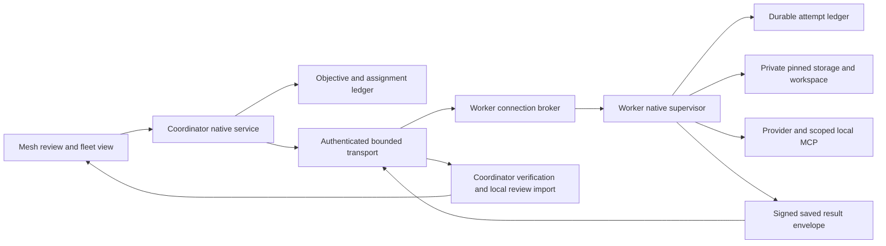

# Remote execution integration contract

This is the implementation direction for the unfinished remote phase, not a claim of remote
execution support. It connects the merged [input foundations](fleet-remote-delivery.md) to the
[complete fleet objective](fleet-orchestration.md). Existing projects, manual work and external
harnesses remain independent of this optional execution route.

## Requirements and boundaries

The coordinator owns objective limits, dependency decisions and the user-visible review selection.
The worker owns its private filesystem, provider processes, execution credentials and durable local
receipts. A remote pathname is never a local `WorkspaceBinding`. Neither side may reinterpret a
lost connection, expired lease or missing response as successful completion or permission to retry.
The renderer displays native facts and cannot admit host keys, storage paths or launch authority.

A verified file tree does not reproduce the source operation DAG. Initializing that tree creates
an independent worker workspace with its own local initial operation. Record both identities:
source input operation/bundle and worker workspace installation/initial operation. Later checkpoints
must descend from that worker initial operation. Never label the worker operation as the original
source operation, or accept a claimed shared ancestry merely because their files match.

Initial deployment targets an explicitly provisioned Unix worker, using only capabilities verified
on that host. No automatic installation, account/SSH-key changes, signing changes or host discovery
is part of executing an assignment. Host/provider admission must report unsupported capabilities
before allocating execution. Actual second-machine evidence remains mandatory.

## Components and data flow

The broker serves transport requests; it does not own the provider's lifetime. A separately admitted
native supervisor owns execution so connection loss cannot silently terminate or relaunch a worker.
The supervisor retains the same custody, signer and scoped MCP rules as local execution. A broker
restart can query retained evidence but cannot adopt a process solely from a PID or a directory name.

Use native-configured OpenSSH stdio as the first transport backend rather than adding a new TLS
server or encryption protocol. SSH supplies encrypted transport and host/account authentication;
Mesh still needs independently admitted coordinator/worker keys and assignment-specific proofs.
The existing worker challenge is only one direction of that proof. It must not become a general
signing oracle, and a reply to it alone cannot authorize a receiver to execute.

The proposed client uses a fixed installed worker entry point, strict host-key verification,
noninteractive authentication, no PTY and no agent/port forwarding. No task, path, goal or secret is
interpolated into a remote shell command. Native host configuration is an authority boundary;
agent-supplied SSH options, aliases or config fragments are not admitted. Verify the deployed
client's supported options; do not silently relax a failed configuration. OpenSSH documents command
execution and forwarding in [ssh(1)](https://man.openbsd.org/ssh.1), and host-key/noninteractive
controls in [ssh_config(5)](https://man.openbsd.org/ssh_config.5).

Task-bearing frames travel over stdin/stdout, not command arguments. Bound frame lengths before
allocation: at most 1 MiB for a manifest and 64 KiB for a chunk part, retaining existing total-input
bounds. Versioned control frames have a smaller explicit tested bound. Drain bounded stderr into
redacted diagnostics independently. Unknown protocol versions, fields and message types refuse.
Backpressure limits queued bytes and concurrent transfers; it cannot erase durable acknowledgments.

## Durable identities and launch ownership

Every control request binds configured coordinator identity, objective, lane, run, assignment,
worker identity, exact input/bundle, request identity and expected lease sequence. Provider and goal
are fixed when the assignment is admitted. A changed body under the same request identity refuses.
Separate connection nonces from durable request identities so reconnect can recover receipts without
reusing a challenge or producing another grant to launch.

The worker's uniqueness key is coordinator identity + objective + assignment identity. It spans all
allocations, not just one working folder. Changing the lane, run, bundle or destination cannot make
a second allocation eligible to execute the same assignment. Use transactional native persistence
with the same preserve/refuse discipline as the existing fleet ledger; do not rely on a process-local
map or a create-only folder as the complete attempt registry.

Persist these facts in order:

1. Authenticated admission with immutable request digest and inherited limits; receipt only, no launch.
2. Verified transfer and private allocation identity. Recheck exact bytes and physical custody.
3. Worker workspace initialization and explicit source-to-worker version binding.
4. Launch intent with expected provider, workspace and native ownership identity, committed before spawn.
5. Provider acknowledgment, followed by durable checkpoint/result receipts and observed disposition.

Receipt replay returns retained facts; only the original transaction may create a launch permit.
If persistence or spawn acknowledgment is uncertain, retain the claim and its concurrency slot.
A crash between intent and spawn does not establish that spawn never happened. Reconciliation must
supply independent native evidence before a later action; PID reuse or lease expiry is insufficient.
Partial allocations, changed roots and unavailable history are preserved and refused, never repaired
by recreating a missing workspace or automatically deleting a marker.

## Receiving storage before network exposure

The generic CAS receiver currently requires its caller to own and revalidate storage. Its default
filesystem is not a sufficient network-facing storage capability. Add a native receiving wrapper
whose CAS operations use retained directory authority, bound reads and retain the admitted allocation
boundary. Receipt, status, resumed writes and final verification must all refuse a replaced namespace.
A pre/post pathname check alone cannot prevent an intervening write from reaching a substituted root.
The already-pinned materializer does not remove this requirement from earlier transfer writes.

A native destination supplies the store and allocation parent; peers never choose either path.
Exclude protected user-project roots and enforce private permissions. Preserve protocol bounds,
complete-file hashes, empty entries, portable modes and create-only output checks. Space exhaustion
must produce a retained incomplete receipt, not completion, cleanup or an automatic retry grant.

## Checkpoints, reconnect and local review

A worker result envelope binds the complete assignment, original input/bundle, worker installation
and initial operation, exact checkpoint/version/review, output bundle and completion evidence. Sign
it with the configured worker execution key. This key is distinct from protected-main approval
credentials; remote providers never receive the user's approval authority.

The coordinator verifies the envelope and complete transferred output, then imports an independent
local private result with explicit remote provenance. A receipt stores both remote and local review
identities. Native review panels consume the local verified representation, never a remote path.
Recheck current dependency rejection/revocation and exact source input before presenting a result as
eligible for integration. Reading historical bytes remains separate from consuming a dependency.

A reconnect sends the durable assignment identity and last acknowledged receipt sequence. Return
already committed receipts and confirmed partial offsets. Reject stale lease/control sequences;
sequence advancement neither relaunches work nor frees a slot. If cancellation is unconfirmed,
display stopping/uncertain. Acknowledged checkpoints survive disconnection and remain inspectable
without assuming the worker is still alive. No remote result or completion advances protected main.

## Delivery increments and acceptance

Each row is a coherent PR boundary; publish it before starting the next substantial increment.

| Increment | Deliverable and decisive verification |
| --- | --- |
| Native receiving storage | Real CAS transfer through retained authority; replacement, links, growth, partial resume and out-of-space refusal without writes escaping the admitted store |
| Receiving attempt lifecycle | Transactional uniqueness across allocations; source/worker version binding; crash points before/after initialization, intent and acknowledgment; no duplicate permit |
| Broker and supervisor | Local stdio integration with actual private workspace/provider/MCP; broker loss does not lose supervisor ownership; malformed frames and bounds refuse |
| Authenticated transport | Real admitted SSH endpoint plus bidirectional Mesh identity binding; wrong host/key, changed request, replay and unsupported capability refuse before execution |
| Saved results and reconnect | Signed exact result export/import, lost receipt replay, revocation, changed bytes and unknown worker state; local saved review remains available |
| Presentation and second-machine proof | Native worker/connection facts, four existing review lanes unaffected, actual disconnect during transfer/work/after checkpoint, reconnect with exactly one attempt and retained results |

Local process tests may verify protocol and crash behavior; they do not satisfy the second-machine
row. Run the complete canonical checks for substantive increments and combined main. Preserve failed
traces and distinguish mocked, native, real-provider, remote and packaged evidence. Host credentials,
a provisioned second machine and eligible signing remain external inputs; do not call the phase done
because these inputs are unavailable.

## Trade-offs and follow-up

SSH reduces initial deployment and transport-cryptography work but requires explicit host provisioning
and introduces process-startup and operating-system differences. A resident worker supervisor adds
lifecycle responsibility, but is necessary to separate connection lifetime from execution ownership.
An independent worker history requires explicit provenance and result import, avoiding false ancestry
at the cost of another verified mapping. Start with bounded transfers and existing objective limits;
revisit throughput, connection pooling, fair scheduling, retention and fleet-wide resource budgets only
after measured second-machine behavior. None of those optimizations may weaken ownership or receipt
semantics. This contract is planned integration work; it does not change current supported capability.

## Atomic commit versus replay

The receiving lifecycle must use a transaction outcome that distinguishes insertion from replay.
The store's additive `append_with_outcome` API now returns `Inserted` only after the insert commits
and the final authority check succeeds. An identical request recovered in the same writer transaction
returns `Replayed`, including after restart and later events. The existing `append` API still returns
the ordinary durable event and remains suitable for callers that do not mint external effects.

This outcome is a storage fact, not a launch capability or caller authentication. The future worker
registry must validate current assignment, workspace, limits and ownership before committing intent,
and grant a non-replayable launch permit only for the original successful insertion. If authority is
lost after commit, the call returns an error; a later receipt recovery remains replay and cannot be
used to infer that no process started or to authorize another launch. A separate pre-read is not an
atomic substitute, because concurrent identical requests can both miss an earlier receipt.
